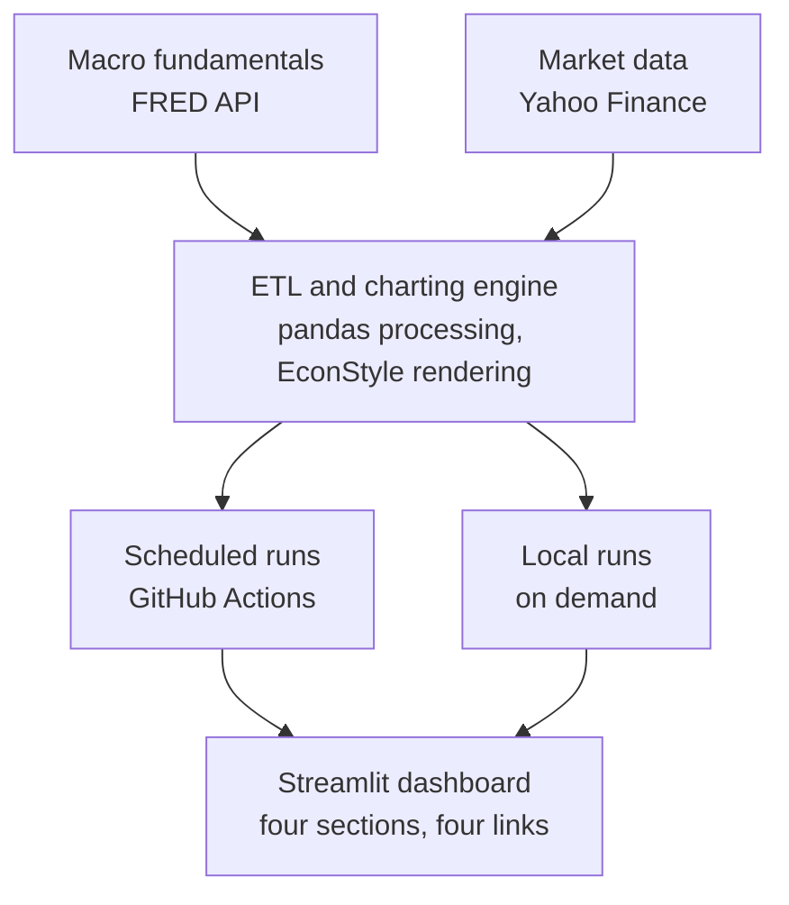
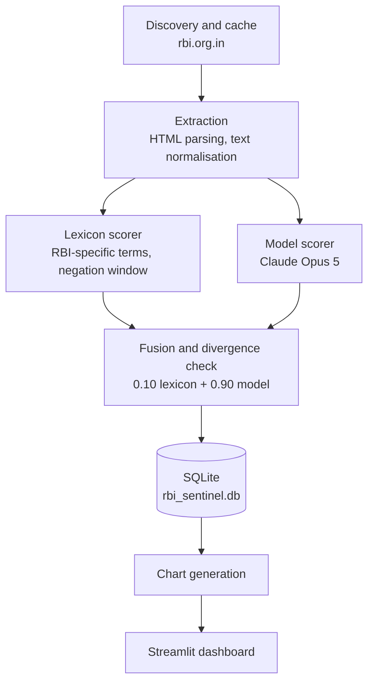

A macro and markets dashboard that rebuilds itself every week without anyone touching it, and a
research project attached to it that scores the tone of Reserve Bank of India policy documents.

Around seventy charts across four sections, drawn from live data each Saturday and published to a
public dashboard. The code is open, the pipeline runs on a schedule, and every figure traces back
to a named source.

 

  <a href="https://weekly-macro-dashboard.streamlit.app/" target="_blank"
     style="display: inline-block; background-color: #003366; color: #ffffff; padding: 1.1rem 2.5rem; font-family: 'Inter', -apple-system, sans-serif; font-size: 0.90rem; font-weight: 700; letter-spacing: 0.08em; text-transform: uppercase; text-decoration: none; border-radius: 3px; box-shadow: 0 4px 12px rgba(0, 51, 102, 0.2); transition: all 0.2s ease-in-out;"
     onmouseover="this.style.backgroundColor='#0A1128'; this.style.transform='translateY(-2px)';"
     onmouseout="this.style.backgroundColor='#003366'; this.style.transform='translateY(0)';">
    Launch Live Dashboard ↗
  </a>

## What it publishes

Four sections, each with its own link and its own generator.

| Section | What it covers | Charts |
|---|---|---|
| [Weekly Markets](https://weekly-macro-dashboard.streamlit.app/) | Equities, rates, credit, FX, commodities, emerging markets and crypto, with the week's moves set against twelve-month trends | 36 |
| [World](https://weekly-macro-dashboard.streamlit.app/world) | Central bank policy rates and calendars, a six-economy scoreboard, US valuations (Shiller CAPE, implied equity risk premium) and country risk | 12 |
| [India](https://weekly-macro-dashboard.streamlit.app/india) | Growth, inflation, monetary conditions, external balances, portfolio flows and the central government's fiscal accounts | 15 |
| [RBI Sentinel](https://weekly-macro-dashboard.streamlit.app/rbi-sentinel) | A tone index for Indian monetary policy, scored from RBI documents | 6 |

The Weekly page also carries **The Week in Headlines**: the week's most-covered stories in world
and Indian economics, collected every four hours from fifteen feeds across nine outlets, and ranked by how many
outlets carried a story and how many days it stayed in the news. Headlines are never written by
the system — an unreadable feed is dropped, not invented.

## RBI Sentinel

Central banks move markets twice: once when they change the policy rate, and again in how they
describe the decision. The rate is a number anyone can read. The description is prose, and reading
it consistently across a decade of meetings is the part nobody does by hand.

RBI Sentinel scores every Monetary Policy Committee document the Reserve Bank has published since
October 2016 on a single hawkish–dovish scale, then asks a deliberately unkind question of the
result: **does the tone tell you anything the rate decision and the RBI's own stated stance do
not?**

### The corpus

| | |
|---|---|
| Period | October 2016 – August 2026 |
| Policy cycles | 61 |
| Documents collected | 285 |
| Document types | MPC Resolution (143), Governor's Statement (81), Minutes (61) |
| Rate outcome by cycle | 40 hold · 13 cut · 8 hike |

Documents are discovered directly from rbi.org.in, not a redistributed dataset. Only press releases
are scored; the Monthly Bulletin reprints the same text weeks later and is classified and excluded,
because scoring it would count a meeting twice.

That outcome distribution deserves a pause. Two thirds of cycles were holds, and only 21 of 61
produced a move at all. Any claim that a text signal "predicts the decision" has to beat a rule as
crude as *always say hold*, which is right 66% of the time.

### How a document is scored

Scoring is a hybrid: **10% rule-based lexicon, 90% large language model.**

- **Lexicon.** A hand-built list of RBI-specific hawkish and dovish phrasing, counted with a
  five-word negation window and density-adjusted through a `tanh` transform so that a long document
  is not mechanically more hawkish than a short one.
- **Model.** Claude Opus 5 reads the full document and returns a score from −1 (very dovish) to +1
  (very hawkish), together with five sub-dimensions: inflation concern, growth assessment, liquidity
  stance, rate guidance and external (rupee) stance.

The 10/90 split is measured, not assumed. Across the corpus the lexicon's standard deviation is
0.263 against the model's 0.587 — the keyword counter is 2.2× narrower, because the `tanh`
normalisation compresses it toward zero. An earlier 25% weighting therefore dragged every confident
reading toward the middle: a document the model read at −0.95 could not be matched by a lexicon
whose range stops near −0.64. At 10% the lexicon survives as an independent cross-check without
flattening the signal.

Divergence between the two is monitored rather than corrected. The threshold sits at 0.60, which
flags about 9% of documents; an earlier 0.40 fired on 43% of them, because it sat inside the normal
distribution of the scale mismatch above and was measuring that, not analytical disagreement.

**A meeting's composite** weights Minutes 50%, Resolution 35%, Governor's Statement 15%. The Minutes
carry the most weight because they record individual members' reasoning, which is where
disagreement shows.

**Facts are extracted without the model.** The rate decision, the stated stance, the RBI's CPI and
GDP projections and the next meeting date are read from the Resolution by regular expression, and
verified against all 61 cycles. Anything a regex can read reliably should not be handed to a
language model: it costs money and introduces a failure mode in which the number on the dashboard
is a plausible invention. Only the tone judgement goes to the model.

### What it found

**Tone does not predict the rate decision.** The composite tracks the policy cycle closely, but once
the RBI's own stated stance is in the model, tone adds nothing. This is a negative result and it is
reported as one. It is also unsurprising in hindsight: the stance *is* the committee's compressed
summary of its own tone, published deliberately.

**No reliable relationship with equities, the rupee or volatility.** Tested against Nifty, Bank
Nifty, USD/INR, gold and India VIX, nothing survived. Given how many pairs were tested, a couple of
suggestive correlations would have been the expected result of chance alone; there were none worth
reporting.

**Tone does line up with the bond market's reaction on decision day.** The change in Resolution tone
from one cycle to the next corresponds to the move in the 10-year government security yield that
day — roughly 5 basis points for a typical shift in tone. This is the one relationship that held,
and it is also the one most plausible in advance: the bond market prices the path of policy, and the
Resolution's language is the clearest public statement about that path.

### The problem with that result, and the test that addresses it

**Every meeting in this sample happened before the scoring model was trained.** A model that has read
financial journalism up to its training cutoff has, in principle, encountered commentary about these
very meetings, including what the bond market did afterwards. Nothing in a backtest can rule out the
possibility that the model is recalling the outcome rather than reading the document.

This is the central methodological risk in applying language models to historical text, and it is
not solved by holding out a test set, because the contamination is in the model's weights, not the
analyst's data split.

**So the project runs a live test instead.** From October 2026, for every new Resolution:

1. The tone score is computed and committed to the repository **before the 17:00 IST government
   securities close**, with a timestamp.
2. The 10-year yield close is entered separately, afterwards, by hand — the RBI publishes no free
   machine-readable close, and rather than substitute a proxy the pipeline opens an issue and waits
   for the real number.
3. Both are appended to a log that is never retroactively edited.

Each meeting is therefore a genuine out-of-sample observation, recorded before the outcome exists.
The sample grows by roughly six observations a year, which is slow — and that is what honest
evidence costs in a field with six data points a year.

Until that log has a meaningful number of entries, the decision-day result should be read as **a
hypothesis with supporting historical evidence, not an established finding.**

## How it is built

### The market pipeline

Two ingestion streams feed one charting engine:

- **Market data** — a `YFinanceFetcher` pulls equity indices, FX pairs, commodities and volatility
  measures.
- **Macro fundamentals** — a `FredFetcher` pulls the full US Treasury curve, credit spreads and
  inflation breakevens from FRED, with a maximum age attached to every series so that a source which
  quietly stops updating fails the run instead of publishing a stale number.

Both are standardised into pandas DataFrames and drawn through a shared `EconStyle` module that
holds every visual constant in the project — colours, sizes, DPI, the rule above each title, the
source line beneath it. No chart sets its own.

GitHub Actions runs the generators on a schedule: Weekly Markets and India on Saturday morning,
World on Saturday mid-morning, RBI Sentinel on weekday evenings and again through the day of an MPC
decision. Each run commits its PNGs. Streamlit Cloud serves them from the repository, and a loader
discovers the newest dated folder by natural sort rather than a hard-coded file list, so adding a
chart requires no change to the app.

### The scoring pipeline

Documents are pulled through the RBI's paginated site, cached locally, and parsed with a
selector waterfall that degrades rather than fails when the page markup changes.

Every score is stored with the version of the method that produced it. Changing the method means
bumping that version, and old scores are kept rather than overwritten, so a published number can
always be traced to how it was calculated.

### Engineering choices worth naming

- **Model spend is capped structurally.** A document reaches the model only if it is new, belongs to
  an MPC cycle and clears a minimum length. A scheduled run scores at most four documents; a larger
  backlog scores nothing and fails the run, so a discovery bug cannot quietly spend money. Normal
  cost is about $0.15 per meeting.
- **Scheduling follows the calendar, not the clock.** The pipeline reads the next meeting date out
  of the latest Resolution and only runs its intraday checks on decision day. Every other day the
  gate exits in seconds.
- **Charts are fingerprinted against the data that drew them,** and a test fails if the database has
  moved since. A stale chart is a wrong chart.
- **There is no mock data anywhere in the project.** A missing API key or an unreachable source
  fails the run. Nothing published is ever a placeholder.

## Limitations

- Sixty-one policy cycles is a small sample, and 21 rate moves is smaller still. Every historical
  result here is provisional.
- The scoring model is closed and versioned by its vendor. Reproducing a score years from now
  requires the same model version, which is why scores are stored with their method version rather
  than recomputed.
- The decision-day result is a same-day association, not a demonstrated trading edge. Nothing here
  has been tested after transaction costs, and the dashboard makes no recommendation.
- The tone scale is one-dimensional by construction. The five sub-dimensions exist because a single
  hawkish–dovish number discards genuine disagreement — a committee worried about inflation and
  growth at once, for instance.

 

  <a href="https://weekly-macro-dashboard.streamlit.app/" target="_blank"
     style="display: inline-block; background-color: #003366; color: #ffffff; padding: 1.1rem 2.5rem; font-family: 'Inter', -apple-system, sans-serif; font-size: 0.90rem; font-weight: 700; letter-spacing: 0.08em; text-transform: uppercase; text-decoration: none; border-radius: 3px; box-shadow: 0 4px 12px rgba(0, 51, 102, 0.2); transition: all 0.2s ease-in-out;"
     onmouseover="this.style.backgroundColor='#0A1128'; this.style.transform='translateY(-2px)';"
     onmouseout="this.style.backgroundColor='#003366'; this.style.transform='translateY(0)';">
    Launch Live Dashboard ↗
  </a>

