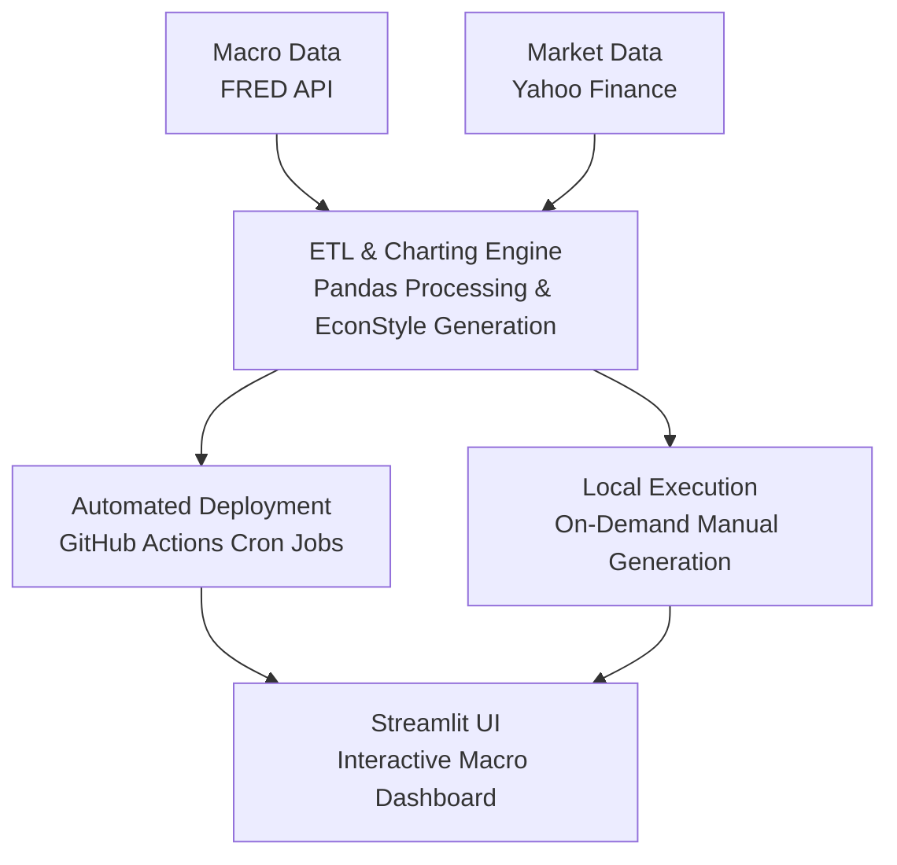
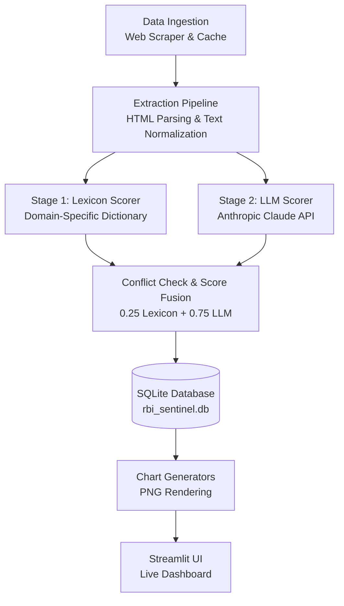

This project is an institutional-grade financial platform that autonomously tracks global cross-asset markets and quantifies Reserve Bank of India policy shifts using natural language processing.

 

  <a href="https://weekly-macro-dashboard.streamlit.app/" target="_blank" 
     style="display: inline-block; background-color: #003366; color: #ffffff; padding: 1.1rem 2.5rem; font-family: 'Inter', -apple-system, sans-serif; font-size: 0.90rem; font-weight: 700; letter-spacing: 0.08em; text-transform: uppercase; text-decoration: none; border-radius: 3px; box-shadow: 0 4px 12px rgba(0, 51, 102, 0.2); transition: all 0.2s ease-in-out;"
     onmouseover="this.style.backgroundColor='#0A1128'; this.style.transform='translateY(-2px)';" 
     onmouseout="this.style.backgroundColor='#003366'; this.style.transform='translateY(0)';">
    Launch Live Dashboard ↗
  </a>

## Overview
The foundation of this platform is the Global Macro Engine, an automated ETL pipeline designed to provide a comprehensive, lag-free read on global cross-asset risk. Because financial assets do not trade in isolation, this system autonomously processes live API data into over 25+ institutional-grade charts weekly — tracking US Treasury yield curves, bond markets, commodities, sector rotation, emerging markets and more. By systematically aggregating these signals, the engine establishes the quantitative baseline required to identify shifting market regimes. 

Layered onto this macro foundation is the RBI Sentinel. It is designed to capture one of the most consistently mispriced signals in emerging market fixed income: central bank forward guidance. A simple read of the policy rate often misses the nuance in language — the subtle shift toward phrases like “withdrawal of accommodation” that tends to precede actual rate moves across the RBI’s MPC statements, minutes, and governor’s remarks. The system addresses this by using a hybrid NLP framework to translate these semantic shifts into a continuous score, ranging from -1.0 (extremely dovish) to +1.0 (extremely hawkish), across more than 30 MPC meetings. In doing so, it converts qualitative rhetoric into a structured, backtestable time series.

## System Architecture I: Global Macro Engine
The Global Macro Engine is a fully autonomous ETL pipeline that ingests live data on a scheduled cadence and transforms it into institutional-grade visualizations. To handle the complexity of the inputs, the data ingestion layer is split into two specialized streams:

* **Market Data:** A custom `YFinanceFetcher` pulls equity indices, FX pairs, commodities, and volatility metrics (VIX/VXEEM) using the `yfinance` library.
* **Macro Fundamentals:** A parallel `FredFetcher` extracts structural economic data, such as full-curve US Treasury yields, credit spreads, and inflation breakevens, directly from the FRED API.

Both streams are immediately standardized into Pandas DataFrames and processed through custom `EconStyle` Matplotlib templates to ensure consistent formatting standards. The execution and deployment layer is entirely serverless:

* **Automated CI/CD:** GitHub Actions triggers `generate_weekly.py` every Saturday (rendering 25+ cross-asset charts) and `generate_macro.py` second Saturday of each month (rendering structural macro charts), committing the PNGs directly to the repository.
* **Dynamic Streamlit Delivery:** Streamlit Cloud serves the live dashboard directly from the `assets/` directory. A custom `chart_loader.py` module handles discovery via filename-agnostic globbing and natural sort, keeping the architecture extensible without hard-coded file lists.

 The complete end-to-end execution is mapped below: 

## System Architecture II: The NLP Sentinel
The RBI Sentinel is a specialized NLP pipeline that autonomously scrapes, cleans, and scores Reserve Bank of India policy documents. To eliminate network latency, documents are pulled via a custom ASP.NET paginator, cached locally, and parsed through a resilient CSS-selector waterfall to extract clean prose.

The extracted text is then evaluated by a two-tier hybrid scoring engine designed to balance contextual nuance with deterministic auditing:

* **Stage 1: Deterministic Lexicon:** Scans for 60+ domain-specific hawkish and dovish phrases using a five-word negation window. Raw hits are density-adjusted via `tanh(hits / √word_count)` to produce a normalized score from -1.0 to +1.0.

* **Stage 2: LLM Contextualization:** Anthropic’s Claude Haiku processes the full document to return a structured JSON object containing seven sub-dimension scores (e.g., inflation stance, liquidity, rate guidance) and a synthesized macro narrative.

* **Score Fusion & Fallback:** The final composite is a weighted fusion ($0.25 \times \text{Lexicon} + 0.75 \times \text{LLM}$). If the absolute divergence between the two stages exceeds 0.4, the system caps confidence at 0.45 and triggers an automatic fallback re-score using Claude Sonnet.

All historical documents, composite scores, and generated narratives are persisted in a five-table local SQLite database (`rbi_sentinel.db`), ensuring complete auditability and reproducibility for the Streamlit dashboard visualizations. The complete end-to-end execution is mapped below: 
  

 

  <a href="https://weekly-macro-dashboard.streamlit.app/" target="_blank" 
     style="display: inline-block; background-color: #003366; color: #ffffff; padding: 1.1rem 2.5rem; font-family: 'Inter', -apple-system, sans-serif; font-size: 0.90rem; font-weight: 700; letter-spacing: 0.08em; text-transform: uppercase; text-decoration: none; border-radius: 3px; box-shadow: 0 4px 12px rgba(0, 51, 102, 0.2); transition: all 0.2s ease-in-out;"
     onmouseover="this.style.backgroundColor='#0A1128'; this.style.transform='translateY(-2px)';" 
     onmouseout="this.style.backgroundColor='#003366'; this.style.transform='translateY(0)';">
    Launch Live Dashboard ↗
  </a>

