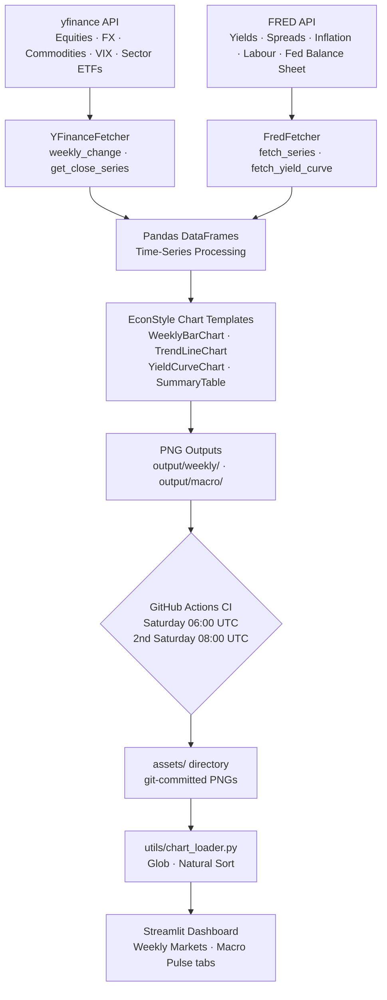

 

  <a href="https://weekly-macro-dashboard.streamlit.app/" target="_blank" 
     style="display: inline-block; background-color: #003366; color: #ffffff; padding: 1.1rem 2.5rem; font-family: 'Inter', -apple-system, sans-serif; font-size: 0.90rem; font-weight: 700; letter-spacing: 0.08em; text-transform: uppercase; text-decoration: none; border-radius: 3px; box-shadow: 0 4px 12px rgba(0, 51, 102, 0.2); transition: all 0.2s ease-in-out;"
     onmouseover="this.style.backgroundColor='#0A1128'; this.style.transform='translateY(-2px)';" 
     onmouseout="this.style.backgroundColor='#003366'; this.style.transform='translateY(0)';">
    Launch Live Dashboard ↗
  </a>

## 1. The Investment Rationale
Central bank language is one of the most systematically mispriced signals in emerging market fixed income. The Reserve Bank of India publishes three document types per MPC meeting — Policy Resolution, MPC Minutes, and Governor's Statement — each calibrated to a different audience and carrying distinct informational content. A pure read of the policy rate misses the forward guidance encoded in this language. A drift toward phrases like "withdrawal of accommodation remains warranted" months before an actual rate hold is a tradeable signal in INR rates, Nifty Bank sector ETFs, and the broader USD/INR forward curve. By quantifying that tone shift into a continuous score on a -1.0 (Extremely Dovish) to +1.0 (Extremely Hawkish) scale and tracking it across 30+ MPC meetings since the committee's inception in October 2016, this dashboard converts qualitative central bank rhetoric into a time series that can be backtested, correlated, and positioned against.

The global macro overlay provides the cross-asset context that makes the India signal actionable. INR assets do not trade in isolation — a synchronized global tightening cycle overwhelms domestic dovishness, while a Fed pivot materially widens the space for RBI accommodation. By co-locating weekly readings on US Treasury yields, IG/HY credit spreads, VIX, VXEEM, commodity curves, and OECD Composite Leading Indicators in a single dashboard, the system enables a regime-aware interpretation of the RBI's tone. The edge is not in any single data point, but in the structured, lag-free combination of high-frequency global risk signals with a machine-readable history of the RBI's own words.

## 2. System Architecture I: Global Macro Engine
The Global Macro Engine is a fully autonomous ETL pipeline that ingests live data from two authoritative sources on a scheduled cadence. Market data — equity indices, sector ETFs, FX pairs, commodity futures, and volatility measures including VIX and VXEEM — is fetched via the `yfinance` library through a `YFinanceFetcher` class exposing clean `weekly_change()` and `get_close_series()` methods. Macro fundamentals — US Treasury yields across the full curve, credit spreads, inflation breakevens, unemployment, and Fed balance sheet data — are pulled via `fredapi` from the FRED API through a parallel `FredFetcher` class. Both fetchers return standardized Pandas `DataFrame` objects, passed through `EconStyle`-governed Matplotlib chart templates (`WeeklyBarChart`, `TrendLineChart`, `YieldCurveChart`, `SummaryTable`) to produce institutional-grade PNGs at consistent DPI and color standards.

The pipeline runs on two GitHub Actions cron schedules: `generate_weekly.py` fires every Saturday at 06:00 UTC producing approximately 27 charts covering markets and cross-asset risk, while `generate_macro.py` fires on the second Saturday of each month to produce 9–11 structural macro charts. Generated PNGs are committed to the `assets/` directory, which Streamlit Cloud serves on the live dashboard. A `utils/chart_loader.py` module handles chart discovery via filename-agnostic glob and natural sort, making the pipeline extensible without any hard-coded file lists.

## 3. System Architecture II: The NLP Sentinel
The RBI Sentinel ingests its corpus directly from `rbi.org.in` via a `MasterFetcher` that paginates the site's ASP.NET `SearchResults.aspx` endpoint using stateful POST requests to the `ProcessPaging()` handler. Each result is routed into one of three document type buckets — Policy Resolution, MPC Minutes, or Governor's Statement — and raw HTML is cached locally under `data/rbi_sentinel_cache/` to minimize redundant network calls. A versioned CSS selector waterfall in `html_extractor.py`, with a smart `<td>` fallback for legacy markup, extracts clean prose from the HTML. All scored documents, sub-dimension scores, and LLM narratives are persisted in a five-table local SQLite database (`rbi_sentinel.db`), spanning `mpc_meetings`, `rbi_documents`, `sentiment_scores`, `meeting_composites`, and a `fetch_log` — making every historical score auditable and reproducible without re-calling any API.

The scoring engine is a two-tier hybrid model. Stage 1 is a deterministic lexicon scorer that scans each document for 30+ hawkish and 30+ dovish domain-specific phrases, applies a five-word negation window that flips term signs, and normalizes the raw hit count via `tanh(hits / √word_count)` to produce a density-adjusted score in `[-1, +1]`. Stage 2 passes the full document to Claude Haiku (`claude-haiku-4-5`) via the Anthropic API, returning a structured JSON object with seven sub-dimension scores (inflation stance, growth stance, liquidity stance, rate guidance, FX/external stance), a key-phrase list, and a two-paragraph narrative. If the absolute divergence between lexicon and LLM scores exceeds 0.4, a conflict flag is raised and confidence is capped at 0.45, triggering a fallback re-score with Claude Sonnet. The final composite is the weighted fusion `0.25 × lexicon + 0.75 × LLM` — the lexicon acts as a deterministic audit layer, while the LLM holds the dominant weight for contextual interpretation. This composite, plus all sub-dimensions and narratives, is written to SQLite and read by six chart modules to produce the visualizations in the RBI Sentinel tab.

```mermaid
flowchart LR
    A[rbi.org.in\nSearchResults.aspx] --> B[MasterFetcher\nASP.NET pagination\n2.5s rate limit]
    B --> C[HTML Cache\ndata/rbi_sentinel_cache/\nResolution · Minutes · Statement]
    C --> D[html_extractor.py\nCSS selector waterfall\nTD fallback]
    D --> E[text_normalizer.py\nDedup · Whitespace · Sentence split]
    E --> F1[Stage 1: Lexicon Scorer\n30+ hawkish · 30+ dovish phrases\nNegation handler · tanh normalization]
    E --> F2[Stage 2: LLM Scorer\nClaude Haiku primary\nClaude Sonnet fallback\nStructured JSON output]
    F1 --> G[Conflict Check\nlexicon - llm > 0.4\n→ confidence capped at 0.45]
    F2 --> G
    G --> H[Fusion\n0.25 × lexicon + 0.75 × LLM\nFinal composite score]
    H --> I[(SQLite — rbi_sentinel.db\nmpc_meetings · rbi_documents\nsentiment_scores · meeting_composites\nfetch_log)]
    I --> J[6 Chart Modules\nStance Meter · Trajectory · Comparison\nSub-dimensions · Narrative]
    J --> K[assets/rbi_sentinel/YYYY-MM/\ngit-committed PNGs]
    K --> L[Streamlit\nRBI Sentinel tab]
```

 

  <a href="https://weekly-macro-dashboard.streamlit.app/" target="_blank" 
     style="display: inline-block; background-color: #003366; color: #ffffff; padding: 1.1rem 2.5rem; font-family: 'Inter', -apple-system, sans-serif; font-size: 0.90rem; font-weight: 700; letter-spacing: 0.08em; text-transform: uppercase; text-decoration: none; border-radius: 3px; box-shadow: 0 4px 12px rgba(0, 51, 102, 0.2); transition: all 0.2s ease-in-out;"
     onmouseover="this.style.backgroundColor='#0A1128'; this.style.transform='translateY(-2px)';" 
     onmouseout="this.style.backgroundColor='#003366'; this.style.transform='translateY(0)';">
    Launch Live Dashboard ↗
  </a>

